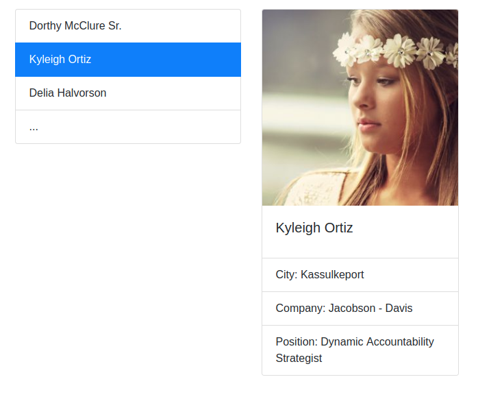

<a name="top"></a>
# 8. Домашнее задание к лекции «Hooks, Context API»

**Перейти к:**  
***[8.2 useJsonFetch](#8.2)  
[8.3 Authentication*](#8.3)***

## 8.1 useEffect (Список и детали)

Вы решили потренироваться в использовании хука `useEffect` и реализовать следующее приложение - список с пользователями, при это при клике на пользователя рядом появляется окно, отображающее детальную информацию о пользователе:



При первой загрузке ни один из элементов не выбран, поэтому отображается только список:


### Механика

Назовём первый компонент (который слева) - `List`, а второй (который справа) - `Details`.

Реализуйте следующую логику:
* При загрузке приложения один раз делается запрос по адресу: https://raw.githubusercontent.com/netology-code/ra16-homeworks/master/hooks-context/use-effect/data/users.json и отрисовывается список в компоненте `List`
* При клике на конкретный элемент списка в компонент `Details` передаются один props: `info` (объект с полями `id` и `name`) и начинается загрузка данных по адресу: https://raw.githubusercontent.com/netology-code/ra16-homeworks/master/hooks-context/use-effect/data/{id}.json, где {id} - это id пользователя из props.
* На время загрузки можете отображать индикатор загрузки (протестируйте с помощью выставления ограничения пропускной способности сети в Dev Tools)

Важные момент:
1. Вся загрузка должна происходить через хук `useEffect`. Подумайте, как организовать единоразовую загрузку и загрузку при каждом изменении `props.info.id`
1. Обратите внимание, загрузка деталей должна происходить только при изменении `props.info.id`, а не при каждом рендере. Т.е. если на одного и того же пользователя кликнуть дважды, то загрузка произойдёт только в первый раз.


## <a name="8.2">8.2 useJsonFetch</a>
***[(наверх)](#top)***

Реализуйте кастомный хук `useJsonFetch`, который позволяет с помощью `fetch` осуществлять HTTP-запросы.

Использование этого хука должно выглядеть следующим образом:
```javascript
const [data, loading, error] = useJsonFetch(url, opts);
```

где:
* `data` - данные, полученные после `response.json()` (не Promise, а именно данные)
* `error` - ошибка (ошибка сети, ошибка ответа - если код не 20x, ошибка парсинга - если пришёл не JSON)
* `loading` - boolean флаг, сигнализирующий о том, что загрузка идёт

Покажите использование этого хука на примере трёх компонентов, каждый из которых делает запросы на следующие адреса (backend возьмите из каталога `backend`):
* GET http://localhost:7070/data - успешное получение данных
* GET http://localhost:7070/error - получение 500 ошибки
* GET http://localhost:7070/loading - индикатор загрузки


## <a name="8.3">8.3 Authentication*</a>
***[(наверх)](#top)***

Вы решили построить систему с аутентификацией.

Используя сервер, расположенный в каталоге `backend`, реализуйте следующее приложение, удовлетворяющее следующим условиям:

1. При первой загрузке показывается Landing-страница с формой входа:


2. После авторизации (POST http://localhost:7070/auth `{"login": "vasya", "password": "password"}`), загружаются компонент ленты новостей и в тулбаре отображается профиль с кнопкой выйти:


Для запроса профиля используйте запрос вида:
```
GET http://localhost:7070/private/me
Authorization: Bearer <ваш_токен>
```

Для запроса новостей используйте запрос вида:
```
GET http://localhost:7070/private/news
Authorization: Bearer <ваш_токен>
```

Важно:
1. Профиль и токен должны храниться в localStorage/sessionStorage (при перезагрузке страницы должна так же загружаться лента новостей, если мы аутентифицированы)
1. Должна быть обработка ошибок, если получена ошибка 401 - то нужно разлогинивать пользователя (удалять всё из localStorage/sessionStorage)
1. Не используйте React Router, просто подменяйте компоненты в зависимости от текущего состояния аутентификации.


